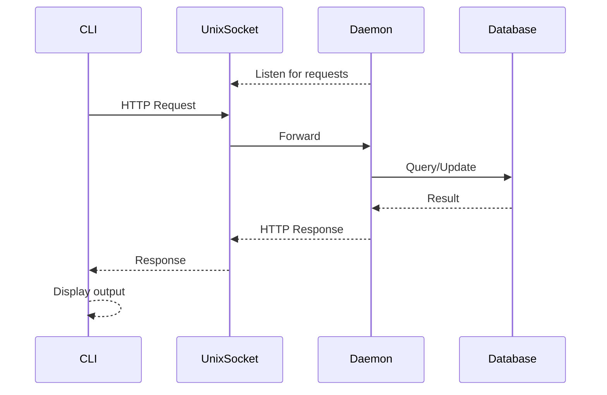

# Architecture

Neoman is a modern documentation reader inspired by Unix `man` pages. It consists of two main components that communicate over a Unix socket.

## System Components

```
┌─────────────────┐          Unix Socket          ┌─────────────────┐
│                 │      (/tmp/nman.sock)         │                 │
│   CLI (nman)    │ ◄──────────────────────────►  │  Daemon (nmand) │
│                 │         HTTP API              │                 │
│ /internal/app/  │                               │ /internal/daemon│
└─────────────────┘                               └─────────────────┘
         │                                                 │
         │                                                 ▼
         │                                        ┌─────────────────┐
         │                                        │     SQLite      │
         │                                        │    Database     │
         ▼                                        └─────────────────┘
   Terminal Output
```

### Daemon (`nmand`)

The backend service that manages documentation. Located in `/internal/daemon/`.

**Responsibilities**:
- Store and index documentation from remote sources
- Serve documentation content via HTTP API
- Handle background tasks (indexing, syncing)

### CLI (`nman`)

The command-line client for users. Located in `/internal/app/`.

**Responsibilities**:
- Parse user commands
- Communicate with daemon via Unix socket
- Display results in the terminal

## Communication Flow



## Daemon Layers

The daemon follows clean architecture with five layers:

```
┌─────────────────────────────────────────────────────────┐
│                      Controller                          │
│              (HTTP endpoints, request handling)          │
├─────────────────────────────────────────────────────────┤
│                       UseCase                            │
│              (Business logic orchestration)              │
├─────────────────────────────────────────────────────────┤
│                       Domain                             │
│              (Business entities and rules)               │
├─────────────────────────────────────────────────────────┤
│                      Repository                          │
│              (Data access interfaces/ports)              │
├─────────────────────────────────────────────────────────┤
│                       Worker                             │
│              (Background/async operations)               │
└─────────────────────────────────────────────────────────┘
```

| Layer | Location | Purpose |
|-------|----------|---------|
| Controller | `/internal/daemon/controller/` | HTTP handlers, route registration |
| UseCase | `/internal/daemon/usecase/` | Business logic, input/output contracts |
| Domain | `/internal/daemon/domain/` | Business entities, validation rules |
| Repository | `/internal/daemon/repo/` | Data access interfaces (ports) |
| Worker | `/internal/daemon/worker/` | Background tasks, async processing |

**Dependency Flow**: Dependencies flow inward toward domain. Controller depends on UseCase, UseCase depends on Domain and Repository interfaces.

## App/Command Layer

The CLI uses a command pattern for user interactions:

| Component | Location | Purpose |
|-----------|----------|---------|
| Command | `/internal/app/command/` | CLI command implementations |
| Main | `/cmd/nman/main.go` | Command routing and entry point |

Each command:
1. Parses user input
2. Makes HTTP request to daemon
3. Handles response/errors
4. Outputs to terminal with appropriate exit code

## Database

Neoman uses SQLite for local storage with Goose for migrations.

**Location**: `~/.local/share/neoman/neoman.db` (configurable)

**Migrations**: `/cmd/daemon/db/migrations/`

### Creating Migrations

Use the make task to create new migrations:

```bash
make migration NAME=<description>
```

This generates a timestamped SQL file. Edit it to add:
- `-- +goose Up` section with schema changes
- `-- +goose Down` section with rollback logic

Migrations are embedded in the binary at compile time and run automatically on daemon startup.

## Project Structure

```
/
├── cmd/
│   ├── daemon/          # Daemon entry point and database setup
│   └── nman/            # CLI entry point
├── internal/
│   ├── daemon/          # Backend (clean architecture)
│   │   ├── domain/      # Business entities
│   │   ├── usecase/     # Business logic
│   │   ├── controller/  # HTTP endpoints
│   │   ├── repo/        # Data access interfaces
│   │   └── worker/      # Background tasks
│   ├── app/             # Frontend/CLI
│   │   └── command/     # CLI commands
│   ├── management/      # Legacy (being migrated)
│   ├── models/          # Legacy (being migrated)
│   └── operations/      # Legacy (being migrated)
├── pkg/                 # Shared utilities
│   ├── config/          # Configuration
│   ├── browser/         # Browser utilities
│   └── git/             # Git operations
└── docs/                # Documentation
```

## See Also

- [CodingConventions/](./CodingConventions/) - Implementation patterns and standards
  - [Overview.md](./CodingConventions/Overview.md) - General principles
  - [Daemon.md](./CodingConventions/Daemon.md) - Daemon layer patterns
  - [App.md](./CodingConventions/App.md) - CLI/Command patterns
  - [FeatureChecklist.md](./CodingConventions/FeatureChecklist.md) - End-to-end implementation guide
- [Legacy.md](./Legacy.md) - Legacy package information
