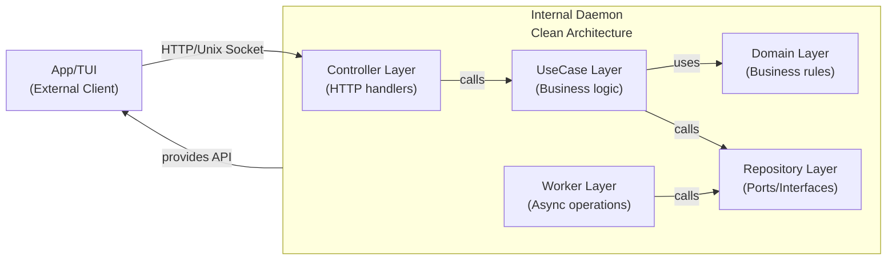

# Architecture

Neoman follows a **clean architecture** pattern to separate concerns and maintain flexibility across the codebase. The project is structured into two main components: the **daemon** (backend) and the **app** (frontend/TUI).

## High-Level Overview



**Note on pkg/ Utilities**: The `/pkg/` shared utilities are accessible to the UseCase layer, Controller layer, and interface implementations (such as repository implementations and workers). However, domain models must remain independent and should not depend on `pkg/` utilities.

## Layers Explained

### Controller Layer (`controller/`)
Entry point for external requests. Handles:
- HTTP endpoint routing and request parsing
- Request validation and error responses
- Orchestration of usecase calls
- Background worker triggering

**Responsibility**: Translate HTTP requests to business operations and return appropriate responses.

### UseCase Layer (`usecase/`)
Business logic orchestration. Implements:
- Core operations (AddRemoteDocs, etc.)
- Input validation and error handling
- Coordination between domain models and repositories
- Error constants for common failures

**Responsibility**: Implement business rules and workflows without HTTP or database specifics.

### Domain Layer (`domain/`)
Core business entities and rules. Contains:
- Domain models (RemoteDocs, DocsPage, RemoteSource)
- Model constructors with validation
- Business logic that belongs to entities
- Domain-specific errors

**Responsibility**: Represent pure business concepts; models are self-validating.

### Repository Layer (`repo/`)
Abstraction for data access and external services. Defines:
- **Ports/Interfaces**: DocsRepository, DocsPageRepository, SourceRegistry
- **Contracts**: What data operations are available
- **No Implementation Details**: Implementations live outside this package

**Responsibility**: Define contracts for data persistence and external service calls.

### Worker Layer (`worker/`)
Background operations and async tasks. Handles:
- Index page processing
- Cron jobs
- Long-running operations

**Responsibility**: Execute time-consuming tasks without blocking HTTP handlers.

## Data Flow Example: Adding Remote Documentation

```
HTTP Request (POST /add/author/repo)
    ↓
Controller.AddDocs()
    ├─ Parse path parameters
    └─ Call UseCase.AddRemoteDocs()
        ↓
    UseCase.AddRemoteDocs()
        ├─ Validate input
        ├─ Check if docs already exist (via Repository)
        ├─ Verify docs/ directory exists (via GitRemote)
        ├─ Create Domain Model (RemoteDocs)
        ├─ Download source (via SourceRegistry)
        ├─ Save to persistence (via Repository)
        └─ Return success/error
    ↓
Controller processes response
    ├─ Handle any errors
    └─ Trigger Worker for async indexing
        ↓
        Worker.IndexPages()
        └─ Parse documentation files → create DocsPage models → save via Repository
```

## Dependency Flow

Dependencies flow **inward** toward domain:
- Controller → UseCase → Domain
- UseCase → Repository (interfaces only, not implementations)
- Worker → Repository (interfaces only, not implementations)
- Domain has no external dependencies

This ensures domain logic is testable and independent of infrastructure.

## Adding New Features

### To add a new operation:

1. **Define Domain Model** (`domain/`): Create any new models needed
2. **Define Repository Interfaces** (`repo/`): If new data access needed, extend ports
3. **Implement UseCase** (`usecase/`): Add operation method with input structure and errors
4. **Add Controller Endpoint** (`controller/`): HTTP handler that calls the usecase
5. **Add Worker Task** (`worker/`, optional): If async processing needed

### To extend existing operations:

- Modify UseCase methods to add new logic
- Add new error constants for new failure modes
- Update Controller to handle new error types
- Extend Worker if new background processing needed

## App Layer (Planned)

The `/internal/app/` package will implement the frontend/TUI. It will:
- Communicate with daemon via HTTP API
- Render terminal UI based on daemon responses
- Maintain session state
- Handle user input and interactions

See [App.md](./App.md) for details.

## Legacy Packages

The `management/`, `models/`, and `operations/` packages under `/internal/` are legacy and gradually being migrated into the clean architecture. See [Legacy.md](./Legacy.md) for details.

## See Also

- [Daemon.md](./Daemon.md) - Detailed layer documentation
- [CodingConventions.md](./CodingConventions.md) - Patterns and standards
- [App.md](./App.md) - Frontend/TUI documentation
- [Legacy.md](./Legacy.md) - Legacy packages
